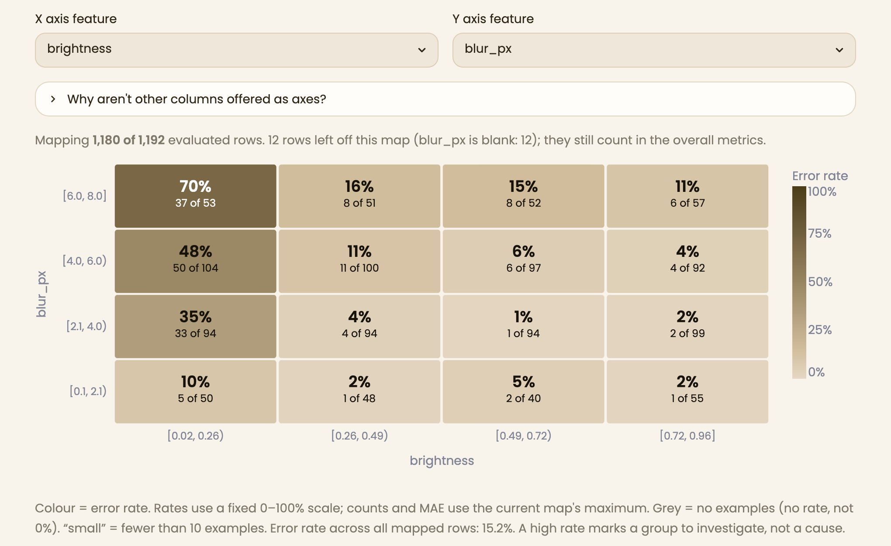
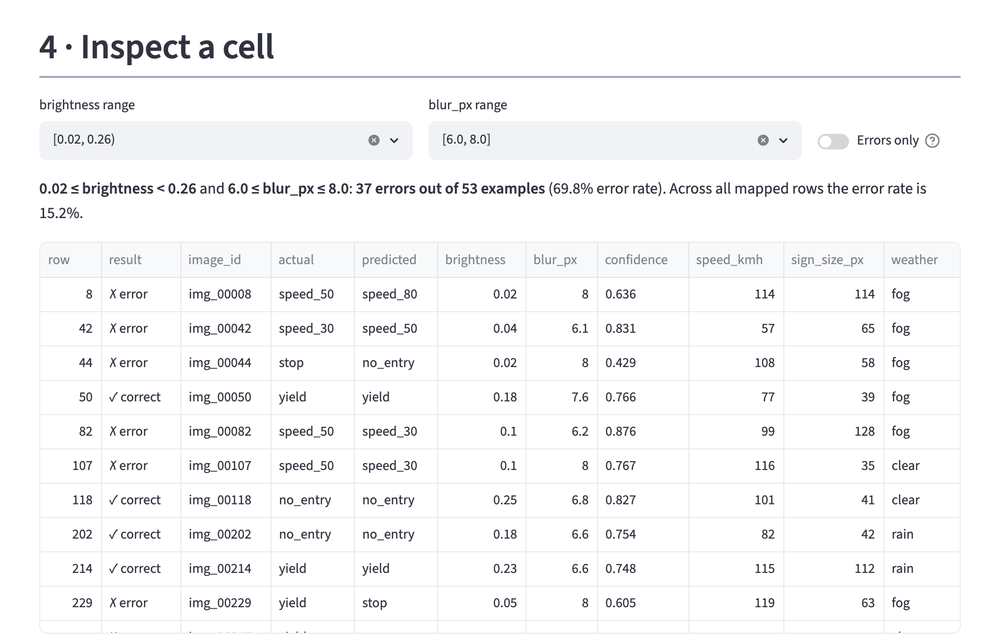
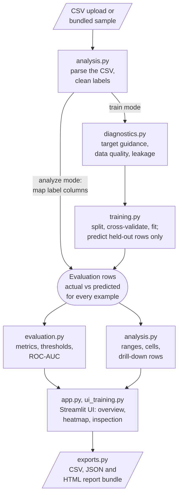

# Model Failure Atlas

[](https://github.com/jpbanquicio16/2026-Hackathon/actions/workflows/ci.yml)

**The model has an overall score, but which kinds of examples does it get wrong?**

**Start here:** [Real wine-quality case study](docs/CASE_STUDY.md) ·
[Measured performance](docs/benchmarks.md) · [Verification results](docs/VERIFICATION.md) ·
[Deployment instructions](docs/DEPLOYING.md)



Model Failure Atlas is a Streamlit app for exploring where a model goes wrong.
Choose one of two workflows at the top of the page: analyze existing predictions,
or train a model and generate held-out predictions. Choose **Classification** or
**Regression** as the prediction task. Then pick two numeric features. The app reports
overall performance, splits both features into ranges, and colours each combination
of ranges by its error rate (classification) or error magnitude (regression). Select
a cell to see the exact rows behind its numbers.

Both workflows use the same calculations, heatmap and row inspection. Training mode
labels all results **Held-out test performance** and never substitutes training
performance for a test result.

## Features at a glance

| Area | What the app does |
| --- | --- |
| Tasks | Classification and regression, in both workflows |
| Models | 7 classifiers and 6 regressors (scikit-learn), compared on identical rows |
| Splits | Stratified random, grouped (group-disjoint) and time-ordered held-out splits |
| Validation | Rank candidates by training-fold CV, lock one model, then reveal its test result |
| Features | Numeric imputation/scaling and categorical one-hot encoding fitted inside every training fold |
| Uncertainty | 95% Wilson cell error-rate intervals and exploratory cell-versus-rest comparisons |
| Imbalance | None, class weights or oversampling, applied inside each training fit |
| Checks | Target-type guidance, dataset quality summary, target-leakage detection |
| Metrics | Accuracy, balanced accuracy, precision/recall/F1, normalised confusion matrices, MAE/RMSE/R², ROC-AUC |
| Probabilities | Confidence analysis, binary threshold exploration, multiclass ROC-AUC (macro/weighted, OvR/OvO) |
| Explanations | Model-based and permutation feature importance; exact row explanations for linear models and single trees |
| Provenance | Dataset fingerprint, split ID, full metadata, downloadable/replayable run archives and report bundles |

## Quick start

Use **Python 3.12**. Runtime and development dependencies are pinned, including
transitive dependencies, for reproducible Linux/macOS installations.

```bash
git clone https://github.com/jpbanquicio16/2026-Hackathon.git
cd 2026-Hackathon
python -m venv .venv
source .venv/bin/activate
pip install -r requirements.txt
streamlit run app.py
```

The app opens at <http://localhost:8501> with the sample dataset loaded. To use
your own data, choose **Upload a CSV** in the sidebar.

For real data, select **White wine case study** in the existing-predictions workflow.
The [case study](docs/CASE_STUDY.md) documents the source/license, duplicate handling,
grouped split, majority baseline, CV selection, held-out results and an independently
audited failure slice. Its prediction CSV and source row IDs are included in `examples/`.

## Select a model without using test scores

1. Choose **Train a model and evaluate it**, upload labelled data and select a target.
2. Select numeric/categorical features, split settings and candidate models.
3. Click **Fit and compare on training data**. Candidates are ranked by CV balanced
   accuracy (classification) or CV MAE (regression); test predictions do not yet exist.
4. Choose a candidate and click **Lock model and reveal held-out test performance**.
   Only that candidate is evaluated. Further experiments on this dataset/target are
   marked as exploratory test reuse within this session.
5. Inspect a map cell, then **Prepare evaluation report**. Download a **reproducible
   run archive** to retain the dataset, selected settings, predictions and displayed report.

Text categories use fold-local most-frequent imputation and one-hot encoding. Unseen
categories yield all-zero indicators. Numeric codes can explicitly be treated as
categories; `01`, `1` and `1.0` stay distinct. Numeric features use median imputation
and standard scaling. Map axes remain numeric; dates/free text need feature engineering.

## Restore and reproduce experiments

In training mode choose **Restore a saved run**, upload `experiment.atlas.zip` and
click **Reproduce saved run**. Atlas refits the recorded configuration, verifies split
row IDs, and compares predictions byte for byte. ZIP members are size-limited and
integrity-checked; no pickled model or uploaded Python code is executed.

```bash
python scripts/make_wine_case_study.py
python scripts/reproduce_run.py examples/wine_case_study/wine_quality.atlas.zip --output /tmp/atlas-replay
python scripts/benchmark_atlas.py
```

Run archives contain the **complete uploaded dataset**. Store them appropriately.
They are saved by downloading, not to shared server storage. Restored reports retain
the original view, including thresholds and selected cells. Reproduction checks the
original selected model's predictions; it does not silently select another model.
Changes to Atlas's calculation code, Python major/minor version or ML package versions
block exact replay unless you explicitly allow an exploratory replay. Prediction
differences are always reported. Replaying a run also records test exposure for
subsequent experiments in that session. Archive hashes detect corruption; they do
not authenticate the archive's author.

`requirements.in` lists upgrade ranges; `requirements-lock.txt` and
`requirements-dev-lock.txt` are the installation sources. To update, resolve
`requirements.in` in a clean Python 3.12 environment, install the development tools
and Linux `watchdog` dependency, run `scripts/lock_dependencies.py`, and rerun the
tests, case study and benchmark. Commit updated outputs with the lock changes.

## Demo walkthrough (about two minutes)

The sample file, `sample_predictions.csv`, is **synthetic**: results from an
imaginary traffic-sign classifier on 1,200 images (see [Sample data](docs/USER_GUIDE.md#sample-data)).

1. **Data.** The app reports: *1,200 rows uploaded. 8 rows excluded because the
   actual or predicted label was missing. Analysis uses 1,192 rows.* The label
   columns are detected automatically.
2. **Overall score.** Accuracy is **85.0%** (1,013 correct out of 1,192 evaluated
   rows). The confusion matrix shows that the most common mistake is `speed_30`
   read as `speed_50`. It also flags `speed_80` as a class that was predicted but
   never occurs as an actual label.
3. **Failure map.** With brightness on X and blur on Y, one corner stands out.
   Dark, blurry images (brightness 0.02–0.26, blur 6–8 px) are wrong
   **37 times out of 53 (69.8%)**. Across all mapped rows the error rate is
   15.2%, and the best cell is wrong 1 time in 94.
4. **Inspect.** Click that cell, or choose its two ranges. The table lists exactly
   those 53 rows; switch on **Errors only** to see the 37 mistakes. If you open
   **Optional columns** and confirm what the confidence column means, the app also
   shows that the model's average confidence on those mistakes is still 0.62.

   

5. **The caution.** Switch the Y axis to `speed_kmh`. Dark, fast images also look
   bad (45 of 72 wrong), even though the generator never uses speed directly: blur
   increases with speed. The map shows **where** errors concentrate, not **why**.

## Architecture



Both workflows meet at the same evaluation rows: training mode turns its held-out
predictions into the same actual/predicted table an uploaded CSV provides, so every
metric, map cell and drill-down comes from one code path. Only `app.py` and
`ui_training.py` import Streamlit. The other modules are plain pandas and scikit-learn
code with their own unit tests, and the UI is tested end to end with Streamlit's
headless `AppTest`.

| Module | Responsibility | Streamlit |
| --- | --- | --- |
| `app.py` | Page flow for both workflows: column mapping, overview, probabilities and thresholds, ROC-AUC, heatmap, cell selection, reports | Yes |
| `ui_training.py` | Training controls, quality and leakage display, experiment history, model comparison and explanations | Yes |
| `analysis.py` | CSV loading, label cleaning, evaluation rows, overview, ranges and cells | No |
| `training.py` | Splits, cross-validation, tuning, models, imbalance, calibration, fingerprint, run metadata, comparison and history tables, explanations | No |
| `evaluation.py` | Regression and per-class metrics, normalised confusion, thresholds, ROC-AUC averaging, uploaded probability validation | No |
| `diagnostics.py` | Target profile and guidance, class balance, dataset quality, leakage detection | No |
| `exports.py` | JSON-safe metadata, report files and ZIP bundle | No |
| `preprocessing.py` | Feature-type eligibility and fold-local numeric/categorical transformations | No |
| `uncertainty.py` | Wilson intervals and exploratory Fisher/Holm cell comparisons | No |
| `experiments.py` | Bounded run archives, integrity checks and deterministic replay | No |

Everything else:

```text
sample_predictions.csv      Synthetic demo data (traffic signs)
iris.csv                    Labelled Iris data for training mode
data/                       Licensed UCI white-wine source data and attribution
examples/                   Churn, Iris and wine predictions; wine report and replay archive
scripts/                    Data generators, case study, replay, dependency locks and benchmarks
docs/                       User guide, methodology, deployment notes and screenshots
tests/                      pytest suite (see Testing)
.github/workflows/ci.yml    Lint, tests and benchmark smoke run (Python 3.12, Linux/macOS)
.pre-commit-config.yaml     Commit hooks: ruff and file hygiene checks
ruff.toml                   Lint rules
.streamlit/config.toml      Upload size limit and theme
requirements*.txt           Runtime, test and lint dependencies
LICENSE                     MIT license
```

## Design decisions

The choices that most affect whether the numbers can be trusted:

- **Only held-out rows are scored.** In training mode every metric, map cell and
  drill-down row comes from the test split, and training performance is never shown in
  its place. Cross-validation and hyperparameter search use the training rows only,
  and compared models share identical splits, so their scores are a controlled
  comparison.
- **Splits follow how the data was collected.** Random splits are stratified, with no
  silent unstratified fallback. Grouped splits keep every row of a group on one side,
  and time-ordered splits train on earlier rows and test on later ones. A random split
  of grouped or time-dependent data puts near-copies of test rows, or future
  information, into training and inflates the score.
- **Preprocessing and rebalancing happen inside each fit.** Imputation, scaling, class
  weights and oversampling are fitted on training folds only, including validation and
  calibration folds, and test rows are never reweighted or resampled. Fitting them on
  all rows would leak test-set statistics into training.
- **Leakage checks warn rather than block.** Columns that copy, encode or determine the
  target, or have prediction-like names, are flagged with plain-language reasons, and
  the run metadata records any flagged feature you train on. The checks look at values
  and names, so they cannot see leakage through feature combinations or post-outcome
  columns with innocent names; a clean result is not presented as proof.
- **Equal-width ranges by default.** Every range on an axis spans the same width, so
  the map reads like an ordinary chart axis, and edges are rounded to readable values
  that rows are actually assigned by. Skewed features can leave cells nearly empty,
  which is why quantile and custom boundaries are one setting away.
- **One cell assignment behind every view.** Each row is assigned to its cell once. The
  heatmap, the drill-down table and the table view all read that assignment, and the
  page footer re-checks the totals on the live data.
- **Nothing is guessed silently.** Labels are compared exactly after trimming, so `01`,
  `1` and `1.0` stay distinct classes (with a warning). Rows missing a label are
  excluded and counted, confidence and probability columns are used only after you
  confirm what they mean, and an empty cell is grey, never 0%.

## Testing

```bash
pip install -r requirements-dev.txt
pytest
pre-commit install  # runs ruff and file checks on every commit
```

The suite includes headless Streamlit `AppTest` journeys, so it needs no browser.
[GitHub Actions](.github/workflows/ci.yml) runs the same commit hooks, and the tests on
Python 3.12 on Linux and macOS, for every push to `main` and every pull request.

| File | Covers |
| --- | --- |
| `test_analysis.py` | Hand-worked fixture, ranges, validation, invariants |
| `test_heatmap.py` | Structure of the chart specification |
| `test_app.py` | User journeys via AppTest (selection resets, uploads) |
| `test_training.py` | Reproducible split, export, preprocessing isolation and failures |
| `test_extended_training.py` | CV/tuning isolation, grouped/time splits, oversampling, regressors |
| `test_evaluation_features.py` | Metrics, thresholds, quantile/custom ranges, confidence bins, quality checks, report files |
| `test_leakage.py` | Encoded targets, numeric transforms, tokenised names, non-leaks |
| `test_training_hardening.py` | Grouped coverage, SVM probabilities, target guidance, class weights, fingerprint, progress, history, explanation fallbacks |
| `test_probability_auc.py` | Multiclass ROC-AUC modes vs scikit-learn, probability mapping |
| `test_ui_flows.py` | AppTest: regression, comparison, thresholds, history, leakage, target guidance, SVM ROC-AUC, probability mapping |
| `test_portfolio_workflows.py` | No test predictions before locking, unseen categories, exact category spelling, uncertainty, archive integrity and UI restore |

Compare the old and current dataset fingerprints on a large synthetic frame with
`python scripts/benchmark_fingerprint.py [rows] [columns] [models]` (defaults
200,000 × 12, three models). Timings are printed, not asserted, because they
depend on the machine.

## Limitations

- **Limited categorical support.** Repeated text categories (up to 50 distinct values)
  are encoded; dates, free text and high-cardinality columns require feature engineering.
  Map axes must be numeric.
- **Leakage detection is heuristic.** It catches copies, encodings, deterministic
  mappings, simple transformations and suspicious names, but not leakage through
  combinations of features or columns recorded after the outcome under innocent names.
- **Download-based persistence.** The latest 10 revealed runs stay in this session.
  Download run archives to restore them later; no shared server database is used.
  The app cannot track test peeking across sessions or outside Atlas.
- **Interactive-scale data.** Uploads are capped at 25 MB, and nearest neighbors, SVMs
  and hyperparameter search get slow on large files.

The full list is in the [methodology notes](docs/METHODOLOGY.md#limitations).

## Documentation

- [User guide](docs/USER_GUIDE.md): both workflows step by step, models, splits and
  validation, checks before training, CSV requirements and the sample data.
- [Methodology](docs/METHODOLOGY.md): how every number is calculated, how to read the map
  responsibly, interface choices and the full list of limitations.
- [Deploying](docs/DEPLOYING.md): running the app on Streamlit Community Cloud.

## License

MIT. See [LICENSE](LICENSE).
